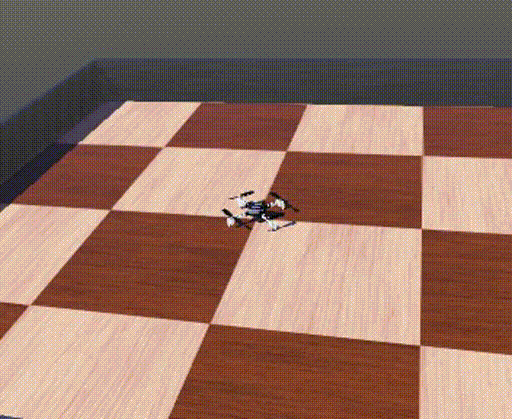

# IMAV/IROS devel env

Experimental environment to build for the CrazyFlie + AI Deck

Includes the required dependencies to:

- Build the CrazyFlie firmware
- Build the AI Deck GAP8 software
- Launch the IMAV Webots simulated environment
- Includes a ROS Foxy installation (JIC)

